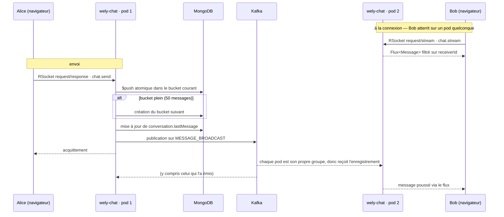

# wely-chat

Service de **messagerie temps réel** de la plateforme [Wely Calendar](https://github.com/WelyLabs/wely-platform).

C'est le service le plus intéressant techniquement du projet : communication bidirectionnelle en RSocket, contre-pression native, et un *bucket pattern* MongoDB pour le stockage des messages.

---

## Rôle

| | |
|---|---|
| **Port** | 8084 (HTTP **et** RSocket over WebSocket) |
| **Préfixe HTTP** | `/chat-service` (exposé sur `/api/v1/chat-service/**`) |
| **Chemin RSocket** | `/rsocket` |
| **Base** | MongoDB (driver réactif) |

---

## Stack

Java 25 · Spring Boot 4 · WebFlux · **RSocket** · Spring Data MongoDB réactif · Spring Security RSocket · MapStruct · Lombok

---

## Pourquoi RSocket plutôt que WebSocket

Un WebSocket brut est un tuyau d'octets : il faut inventer son propre protocole applicatif — format d'enveloppe, routage des messages, corrélation requête/réponse, et surtout gestion du débit.

RSocket fournit tout cela nativement :

| | |
|---|---|
| **Modèles d'interaction** | `fire-and-forget`, `request/response`, `request/stream`, `channel` — ici `request/response` pour l'envoi et `request/stream` pour la réception |
| **Contre-pression** | Le consommateur déclare sa demande (`request(n)`) ; le serveur n'émet jamais plus que demandé. C'est la sémantique Reactive Streams portée sur le réseau |
| **Routage** | Métadonnée `MESSAGE_RSOCKET_ROUTING` — `chat.send`, `chat.stream` — au lieu d'un champ `type` maison |
| **Authentification** | Métadonnée `MESSAGE_RSOCKET_AUTHENTICATION` portant le JWT, validée par Spring Security RSocket |

Sur une stack déjà entièrement Reactor, c'est le protocole cohérent : la contre-pression est de bout en bout, du curseur MongoDB jusqu'au navigateur.

---

## Le bucket pattern

### Le problème

Un document par message donne, pour une conversation active, des dizaines de milliers de documents. Chaque chargement de conversation devient une requête paginée avec tri, et l'index sur `conversationId` grossit indéfiniment.

### La solution

Les messages sont groupés par **50 dans un document `MessageBucket`** :

```
   conversations                        message_buckets
┌──────────────────────┐        ┌────────────────────────────────┐
│ _id                  │        │ _id                            │
│ participantIds[]  🔍 │◀──────▶│ conversationId                 │
│ lastMessage          │        │ bucketIndex : 0                │
│ updatedAt            │        │ messages[ 50 ]  ← messages 1-50│
└──────────────────────┘        ├────────────────────────────────┤
                                │ bucketIndex : 1                │
  aperçu pour la liste          │ messages[ 50 ]  ← messages 51-100
  des conversations             ├────────────────────────────────┤
                                │ bucketIndex : 2                │
                                │ messages[ 12 ]  ← en cours     │
                                └────────────────────────────────┘
```

**Ouvrir une conversation** = lire **un seul document**, le bucket d'index le plus élevé.
**Remonter l'historique** = décrémenter `bucketIndex`, une requête par page de 50.
**Lister les conversations** = lire les documents `conversations`, qui portent déjà `lastMessage` en aperçu — sans toucher aux messages.

### Compaction des champs

Les noms de champs sont stockés abrégés et remappés par la couche de persistance :

```java
public record MessageEntity(
        @Field("m_id") String messageId,
        @Field("s_id") String senderId,
        @Field("s_un") String senderName,
        @Field("txt")  String content,
        @Field("ts")   LocalDateTime timestamp
) {}
```

MongoDB stocke le nom de chaque champ dans chaque document : avec 50 messages par bucket, l'économie est réelle. Le domaine, lui, ne voit que des noms explicites.

---

## Architecture

```
  RSocket                     ┌──────────────────────────────────────┐
  chat.send    ──────────────▶│          application/                │
  chat.stream                 │   messaging/ MessageSocketController │
  HTTP         ──────────────▶│   rest/      ConversationController  │
                              └──────────────────┬───────────────────┘
                                                 │
                              ┌──────────────────▼───────────────────┐
                              │              domain/                 │
                              │   services/ ChatService (POJO)       │
                              │   models/   Message · MessageBucket  │
                              │             ConversationDetail       │
                              │             ConversationSummary      │
                              │   ports/    ChatRepository           │
                              │             MessageBroadcaster       │
                              └────────▲──────────────────▲──────────┘
                                       │                  │
                    ┌──────────────────┴───┐   ┌──────────┴──────────────────┐
                    │   infrastructure/    │   │      infrastructure/        │
                    │ MongoChatRepository  │   │ KafkaMessageBroadcaster     │
                    │   Adapter            │   │   ou LocalMessageBroadcaster│
                    │  → ConversationRepo  │   │ MessageBroadcastConsumer    │
                    │  → MessageBucketRepo │   └──────────┬──────────────────┘
                    └──────────┬───────────┘              ▼
                               ▼                 Kafka · MESSAGE_BROADCAST
                           MongoDB
```

La diffusion est un **port du domaine**, pas un détail du service. `ChatService` ne connaît que
`MessageBroadcaster` ; c'est `chat.broadcast.mode` qui décide, au démarrage, si l'implémentation
est en mémoire ou passe par Kafka.

---

## Flux d'un message



L'ordre compte : la persistance **avant** la diffusion. Diffuser d'abord ferait apparaître chez
le destinataire un message qu'une écriture en échec n'aurait jamais enregistré.

La réception passe par un **flux unique par utilisateur** (`chat.stream`), pas par un flux par conversation : un seul abonnement RSocket suffit à recevoir tous les messages, quelle que soit la conversation ouverte.

---

## API

### OpenAPI

La spécification est générée par `springdoc-openapi` et servie sans jeton :

| | |
|---|---|
| Spec JSON | `http://localhost:8084/v3/api-docs` |
| Swagger UI | `http://localhost:8084/swagger-ui.html` |

Ces deux chemins ne sont **pas** routés par la gateway, et le Service est en `ClusterIP` : rien
hors du cluster ne peut les atteindre. La documentation reste donc active en permanence — c'est
la topologie réseau qui la protège, pas un drapeau.

> Le préfixe de chemin du service est appliqué par package (`…application.rest`) et non par
> annotation. Sélectionner sur `@RestController` attrapait aussi le contrôleur de springdoc, ce
> qui déplaçait la spec en `/chat-service/v3/api-docs` derrière l'authentification.

### RSocket — routes

| Route | Modèle | Description |
|---|---|---|
| `chat.send` | `request/response` | Envoie un message. L'expéditeur est lu dans le JWT, jamais dans le payload |
| `chat.stream` | `request/stream` | Flux des messages destinés à l'utilisateur courant |

Le JWT est transmis dans la métadonnée d'authentification RSocket et validé par Spring Security RSocket.

### HTTP

Préfixées par `/chat-service`, exposées sur `/api/v1/chat-service/**`.

| Méthode | Route | Description |
|---|---|---|
| `GET` | `/conversations?friendId=` | Récupère **ou crée** la conversation avec cet ami |
| `GET` | `/conversations/all` | Liste des conversations de l'utilisateur, avec aperçu du dernier message |
| `GET` | `/conversations/{id}` | Détail d'une conversation (dernier bucket de messages) |
| `GET` | `/conversations/{id}/loadMessages?bucketIndex=` | Remonte l'historique, bucket par bucket |

### Modèles

```java
public record Message(String id, String senderId, String senderName,
                      String receiverId, String conversationId,
                      String content, LocalDateTime timestamp) {}

public record MessageBucket(String conversationId, Integer bucketIndex,
                            List<Message> messages) {}

public record ConversationSummary(String id, ConversationType type, String title,
                                  LocalDateTime updatedAt, Message lastMessage) {}
```

`ConversationType` prévoit `DIRECT`, `GROUP` et `EVENT` ; seul `DIRECT` est implémenté à ce jour.

---

## Gestion des erreurs

| Code | HTTP | Signification |
|---|---|---|
| `CHT-BUS-001` | 404 | Conversation introuvable **ou** n'appartenant pas à l'appelant |
| `CHT-BUS-002` | 404 | Page d'historique inexistante à cet index |
| `CHT-VAL-001` | 400 | Validation du corps de requête, détail par champ |
| `CHT-REQ-000` | *repris* | Chemin inconnu, méthode non autorisée |
| `CHT-TEC-000` | 500 | Erreur inattendue |

**`CHT-BUS-001` confond volontairement « inexistante » et « pas la tienne ».** Distinguer les
deux permettrait d'énumérer les identifiants de conversation et d'apprendre lesquels existent.

Toutes les réponses d'erreur sont des `ProblemDetail` (RFC 7807), avec un `code` stable qu'un
client peut tester et un `timestamp` :

```json
{
  "type": "https://welylabs.app/problems/cht-bus-001",
  "title": "Conversation not found",
  "status": 404,
  "detail": "No conversation matches the given identifier for this user.",
  "instance": "/chat-service/conversations/4a1b…",
  "code": "CHT-BUS-001",
  "timestamp": "2026-09-30T19:23:43.598673Z"
}
```

> `CHT-REQ-000` rend le statut d'origine d'une `ResponseStatusException` — 404 sur un
> chemin inconnu, 405 sur une méthode non autorisée. Sans lui, le handler `Exception.class`
> les avalait toutes et **tout chemin inconnu répondait 500**. C'est le genre de défaut qu'un
> test de route nominale ne voit jamais.

---
## Configuration

| Variable | Description |
|---|---|
| `MONGODB_URI` | URI de connexion MongoDB |
| `KEYCLOAK_ISSUER_URI` | Issuer public — validation de l'émetteur |
| `KEYCLOAK_INTERNAL_JWK_SET_URI` | JWKS interne — récupération des clés |
| `CHAT_BROADCAST_MODE` | `kafka` (défaut) ou `local` — voir ci-dessous |
| `CHAT_BROADCAST_TOPIC` | Topic de diffusion, `MESSAGE_BROADCAST` par défaut |
| `KAFKA_BOOTSTRAP_SERVER` | Broker, en mode `kafka` uniquement |
| `KAFKA_KEY` / `KAFKA_SECRET` | Identifiants SASL/PLAIN |
| `HOSTNAME` | Nom du pod, fourni par Kubernetes ; sert à nommer le groupe de consommation |

---

## Diffusion des messages

Un message doit atteindre son destinataire **quel que soit le pod** sur lequel celui-ci a ouvert
son flux RSocket. Deux implémentations du port `MessageBroadcaster` répondent à ce besoin,
choisies par `chat.broadcast.mode` :

| Mode | Implémentation | Valide à |
|---|---|---|
| `local` | `LocalMessageBroadcaster` — `Sinks.Many` en mémoire | 1 réplica |
| `kafka` | `KafkaMessageBroadcaster` + `MessageBroadcastConsumer` | n réplicas |

**Le piège, en mode `kafka` :** Kafka répartit les enregistrements d'une partition entre les
membres d'un groupe de consommation — exactement un membre reçoit chaque enregistrement. C'est
ce qu'on veut pour une file de travail, et précisément ce qu'on ne veut pas ici : avec tous les
pods dans un même groupe, un message n'atteindrait qu'un pod, et que ce soit celui du
destinataire relèverait du hasard.

Chaque instance est donc **son propre groupe** (`chat-${HOSTNAME}`), ce qui la fait recevoir
tous les enregistrements. La contrepartie à assumer : le topic doit être en rétention courte et
sans compaction, puisque ces groupes sont jetables et que leurs offsets s'accumulent.

La diffusion reste au **mieux-effort**. C'est un canal de mise à jour temps réel, pas la source
de vérité : le message est déjà en base avant d'être diffusé, et un client qui a raté une frame
recharge la conversation. Exiger des acquittements et du rejeu pour une copie qui existe déjà
serait payer cher un problème qui n'existe pas.

Le binder n'est pas autorisé à créer le topic (`auto-create-topics=false`), mais le broker
déployé dans le cluster garde le défaut de Kafka (`auto.create.topics.enable=true`) : il le crée
au premier message, comme pour `USER_CREATED`. Rien à faire côté dev.

`CHAT_BROADCAST_TOPIC` existe pour qu'un topic par environnement reste possible — l'overlay dev
utilise `DEV_MESSAGE_BROADCAST`. C'est indispensable dès que plusieurs environnements partagent
un même broker : les identifiants utilisateur viennent du même realm Keycloak, donc un pod de
dev consommant le topic de prod livrerait ces messages à ses propres abonnés.

Sur un broker infogéré où la création automatique est désactivée, il faut créer le topic
d'avance, avec une rétention courte et sans compaction — les groupes de consommation étant
jetables, leurs offsets s'accumulent :

```bash
kafka-topics --create --topic DEV_MESSAGE_BROADCAST --partitions 3 --config retention.ms=300000
```

---

## Démarrage

```bash
./mvnw spring-boot:run -Dspring-boot.run.profiles=dev
```

Le service expose HTTP et RSocket sur le même port 8084, RSocket étant monté sur `/rsocket` en transport WebSocket.

Pour lancer **toute la plateforme** (bases, Keycloak, gateway, frontend, les quatre services) en une commande sur un Kubernetes local :

```bash
git clone https://github.com/WelyLabs/wely-gitops-infra && cd wely-gitops-infra
kubectl apply -k overlays/local --server-side
```

---

## Tests

```bash
./mvnw test
./mvnw test jacoco:report      # → target-maven/site/jacoco/
```

> **Note build :** ce service produit dans `target-maven/` et non `target/`.

---

## Limites connues

- **La diffusion est au mieux-effort.** Un enregistrement perdu coûte un rafraîchissement, pas
  un message : le choix est assumé et documenté plus haut. Une garantie *at-least-once*
  demanderait un outbox côté producteur.
- **`@Transactional` est inopérant** : aucun `ReactiveMongoTransactionManager` n'est déclaré, la
  création conversation + bucket initial n'est donc pas atomique. L'ajout d'un message, lui, l'est
  désormais — c'est un `$push` conditionné sur l'absence de `messages.49`.
- **Les groupes de consommation s'accumulent.** Un groupe par pod, jetable : chaque redémarrage
  en laisse un derrière lui. Sans rétention courte sur le topic, ces offsets s'empilent côté
  broker ; une purge périodique des groupes inactifs reste à mettre en place.
- **`ConversationType` prévoit `GROUP` et `EVENT`**, seul `DIRECT` est implémenté.
- **Pas de test d'intégration.** Les adaptateurs MongoDB et Kafka sont testés contre des doubles ;
  Testcontainers validerait le `$push` conditionné et le round-trip Kafka contre de vraies
  instances. C'est le chantier suivant sur ce service.
