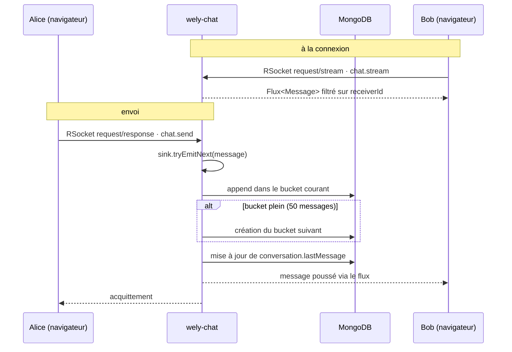

# wely-chat

Service de **messagerie temps réel** de la plateforme [Wely Calendar](https://github.com/WelyLabs/wely-platform).

C'est le service le plus intéressant techniquement du projet : communication bidirectionnelle en RSocket, contre-pression native, et un *bucket pattern* MongoDB pour le stockage des messages.

---

## Rôle

| | |
|---|---|
| **Port** | 8084 (HTTP **et** RSocket over WebSocket) |
| **Préfixe HTTP** | `/chat-service` (exposé sur `/api/v1/chat-service/**`) |
| **Chemin RSocket** | `/rsocket` |
| **Base** | MongoDB (driver réactif) |

---

## Stack

Java 25 · Spring Boot 4 · WebFlux · **RSocket** · Spring Data MongoDB réactif · Spring Security RSocket · MapStruct · Lombok

---

## Pourquoi RSocket plutôt que WebSocket

Un WebSocket brut est un tuyau d'octets : il faut inventer son propre protocole applicatif — format d'enveloppe, routage des messages, corrélation requête/réponse, et surtout gestion du débit.

RSocket fournit tout cela nativement :

| | |
|---|---|
| **Modèles d'interaction** | `fire-and-forget`, `request/response`, `request/stream`, `channel` — ici `request/response` pour l'envoi et `request/stream` pour la réception |
| **Contre-pression** | Le consommateur déclare sa demande (`request(n)`) ; le serveur n'émet jamais plus que demandé. C'est la sémantique Reactive Streams portée sur le réseau |
| **Routage** | Métadonnée `MESSAGE_RSOCKET_ROUTING` — `chat.send`, `chat.stream` — au lieu d'un champ `type` maison |
| **Authentification** | Métadonnée `MESSAGE_RSOCKET_AUTHENTICATION` portant le JWT, validée par Spring Security RSocket |

Sur une stack déjà entièrement Reactor, c'est le protocole cohérent : la contre-pression est de bout en bout, du curseur MongoDB jusqu'au navigateur.

---

## Le bucket pattern

### Le problème

Un document par message donne, pour une conversation active, des dizaines de milliers de documents. Chaque chargement de conversation devient une requête paginée avec tri, et l'index sur `conversationId` grossit indéfiniment.

### La solution

Les messages sont groupés par **50 dans un document `MessageBucket`** :

```
   conversations                        message_buckets
┌──────────────────────┐        ┌────────────────────────────────┐
│ _id                  │        │ _id                            │
│ participantIds[]  🔍 │◀──────▶│ conversationId                 │
│ lastMessage          │        │ bucketIndex : 0                │
│ updatedAt            │        │ messages[ 50 ]  ← messages 1-50│
└──────────────────────┘        ├────────────────────────────────┤
                                │ bucketIndex : 1                │
  aperçu pour la liste          │ messages[ 50 ]  ← messages 51-100
  des conversations             ├────────────────────────────────┤
                                │ bucketIndex : 2                │
                                │ messages[ 12 ]  ← en cours     │
                                └────────────────────────────────┘
```

**Ouvrir une conversation** = lire **un seul document**, le bucket d'index le plus élevé.
**Remonter l'historique** = décrémenter `bucketIndex`, une requête par page de 50.
**Lister les conversations** = lire les documents `conversations`, qui portent déjà `lastMessage` en aperçu — sans toucher aux messages.

### Compaction des champs

Les noms de champs sont stockés abrégés et remappés par la couche de persistance :

```java
public record MessageEntity(
        @Field("m_id") String messageId,
        @Field("s_id") String senderId,
        @Field("s_un") String senderName,
        @Field("txt")  String content,
        @Field("ts")   LocalDateTime timestamp
) {}
```

MongoDB stocke le nom de chaque champ dans chaque document : avec 50 messages par bucket, l'économie est réelle. Le domaine, lui, ne voit que des noms explicites.

---

## Architecture

```
  RSocket                     ┌──────────────────────────────────────┐
  chat.send    ──────────────▶│          application/                │
  chat.stream                 │   messaging/ MessageSocketController │
  HTTP         ──────────────▶│   rest/      ConversationController  │
                              └──────────────────┬───────────────────┘
                                                 │
                              ┌──────────────────▼───────────────────┐
                              │              domain/                 │
                              │   services/ ChatService (POJO)       │
                              │     └─ Sinks.Many<Message>  ⚠        │
                              │   models/   Message · MessageBucket  │
                              │             ConversationDetail       │
                              │             ConversationSummary      │
                              │   ports/    ChatRepository           │
                              └──────────────────▲───────────────────┘
                                                 │
                              ┌──────────────────┴───────────────────┐
                              │           infrastructure/            │
                              │   MongoChatRepositoryAdapter         │
                              │     → ConversationRepository         │
                              │     → MessageBucketRepository        │
                              └──────────────────┬───────────────────┘
                                                 ▼
                                             MongoDB
```

⚠ Le `Sinks.Many` est local au processus — voir [Limites connues](#limites-connues).

---

## Flux d'un message



La réception passe par un **flux unique par utilisateur** (`chat.stream`), pas par un flux par conversation : un seul abonnement RSocket suffit à recevoir tous les messages, quelle que soit la conversation ouverte.

---

## API

### RSocket — routes

| Route | Modèle | Description |
|---|---|---|
| `chat.send` | `request/response` | Envoie un message. L'expéditeur est lu dans le JWT, jamais dans le payload |
| `chat.stream` | `request/stream` | Flux des messages destinés à l'utilisateur courant |

Le JWT est transmis dans la métadonnée d'authentification RSocket et validé par Spring Security RSocket.

### HTTP

Préfixées par `/chat-service`, exposées sur `/api/v1/chat-service/**`.

| Méthode | Route | Description |
|---|---|---|
| `GET` | `/conversations?friendId=` | Récupère **ou crée** la conversation avec cet ami |
| `GET` | `/conversations/all` | Liste des conversations de l'utilisateur, avec aperçu du dernier message |
| `GET` | `/conversations/{id}` | Détail d'une conversation (dernier bucket de messages) |
| `GET` | `/conversations/{id}/loadMessages?bucketIndex=` | Remonte l'historique, bucket par bucket |

### Modèles

```java
public record Message(String id, String senderId, String senderName,
                      String receiverId, String conversationId,
                      String content, LocalDateTime timestamp) {}

public record MessageBucket(String conversationId, Integer bucketIndex,
                            List<Message> messages) {}

public record ConversationSummary(String id, ConversationType type, String title,
                                  LocalDateTime updatedAt, Message lastMessage) {}
```

`ConversationType` prévoit `DIRECT`, `GROUP` et `EVENT` ; seul `DIRECT` est implémenté à ce jour.

---

## Configuration

| Variable | Description |
|---|---|
| `MONGODB_URI` | URI de connexion MongoDB |
| `KEYCLOAK_ISSUER_URI` | Issuer public — validation de l'émetteur |
| `KEYCLOAK_INTERNAL_JWK_SET_URI` | JWKS interne — récupération des clés |

---

## Démarrage

```bash
./mvnw spring-boot:run -Dspring-boot.run.profiles=dev
```

Le service expose HTTP et RSocket sur le même port 8084, RSocket étant monté sur `/rsocket` en transport WebSocket.

Pour lancer **toute la plateforme** (bases, Keycloak, gateway, frontend, les quatre services) en une commande sur un Kubernetes local :

```bash
git clone https://github.com/WelyLabs/wely-gitops-infra && cd wely-gitops-infra
kubectl apply -k overlays/local --server-side
```

---

## Tests

```bash
./mvnw test
./mvnw test jacoco:report      # → target-maven/site/jacoco/
```

> **Note build :** ce service produit dans `target-maven/` et non `target/`.

---

## Limites connues

Ce service concentre les chantiers les plus intéressants du projet.

- **Le fan-out ne franchit pas la frontière du processus.** `ChatService` diffuse les messages via un `Sinks.Many` en mémoire : au-delà d'un réplica, un message émis sur un pod n'atteint pas un destinataire connecté à un autre. Le correctif est un topic Kafka ou Redis Pub/Sub — l'infrastructure Kafka est déjà en place pour `USER_CREATED`.
- **L'ajout dans un bucket n'est pas atomique.** La séquence lecture → ajout en mémoire → sauvegarde du document complet expose à une perte de message si deux envois se croisent. À remplacer par un `$push` conditionné côté MongoDB.
- **Le message est diffusé avant d'être persisté.** Si l'écriture échoue, le destinataire a vu un message absent de la base. L'ordre doit être inversé.
- **`directBestEffort()` abandonne silencieusement.** Le résultat de `tryEmitNext` n'est pas vérifié : une émission perdue ne laisse aucune trace.
- **`@Transactional` est inopérant** : aucun `ReactiveMongoTransactionManager` n'est déclaré, la création conversation + bucket initial n'est donc pas atomique.
- **Pas de gestion d'erreurs.** Contrairement à `wely-users` et `wely-social`, ce service n'a ni hiérarchie d'exceptions ni `@ControllerAdvice`.
- **Couverture de test insuffisante** : une seule classe de test active pour 25 classes de production (`ChatApplicationTests` est entièrement commentée), alors que c'est le service le plus exposé aux problèmes de concurrence.
- **Logs trop verbeux** : `io.rsocket.FrameLogger` est en `DEBUG`, ce qui journalise chaque frame.
